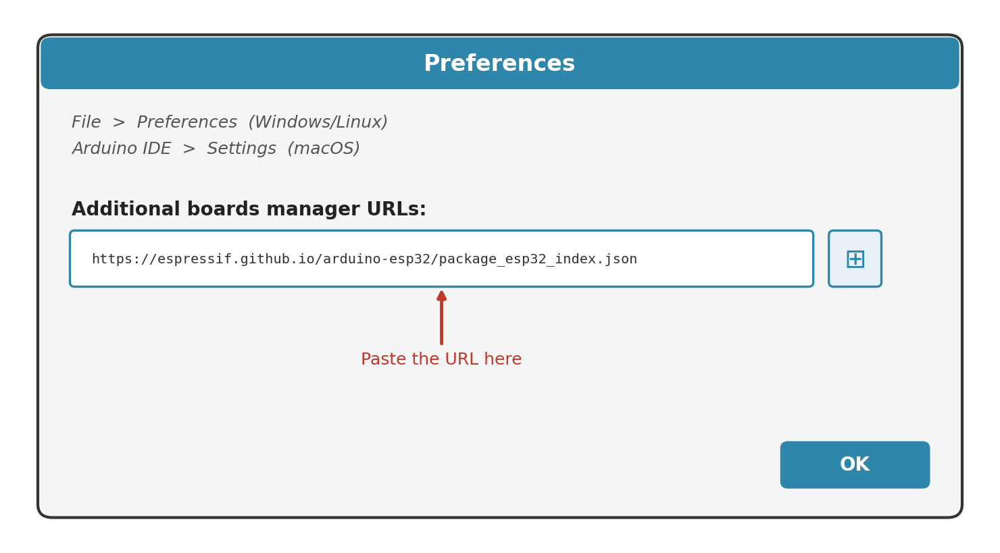
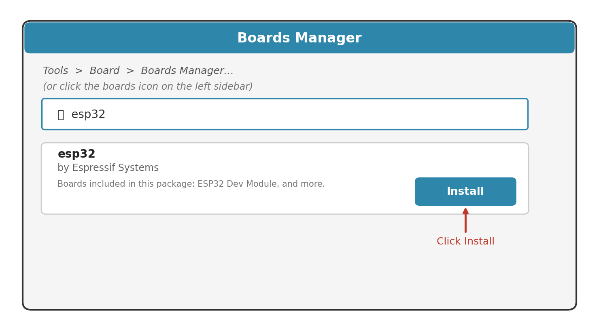
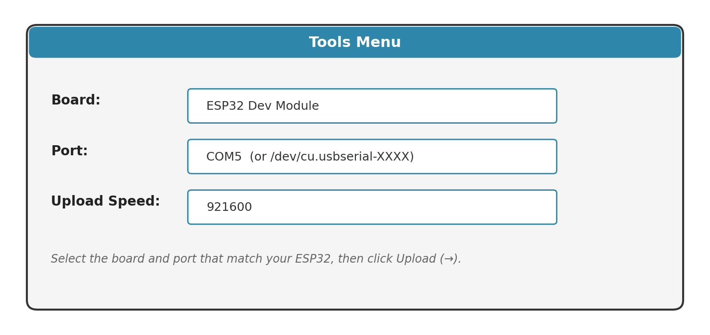

# Guide to Install and Implement Arduino IDE and ESP32

This guide explains how to set up Arduino IDE for an ESP32-WROOM-32 development board and upload a first test program.

## Verification Notes

The setup process in the provided document is correct for:

- Installing Arduino IDE
- Adding Espressif's ESP32 board package
- Selecting an ESP32 board and serial port
- Uploading a Blink test sketch

Corrections and clarifications:

- For an ESP32-WROOM-32 board, use the exact board name if available. If it is not listed, `ESP32 Dev Module` is the correct generic choice.
- A USB data cable is required. A charge-only cable will power the board but will not show a serial port.
- ESP-NOW support comes from the ESP32 board package by Espressif. No separate ESP-NOW library is needed for the Arduino IDE setup.
- ESP-NOW sketches require Wi-Fi initialization in code, usually with `WiFi.mode(WIFI_STA)`.
- For ESP-NOW communication, all ESP32 boards must use the same Wi-Fi channel.

## Step 1 Install the Arduino IDE

Open your web browser and go to the official Arduino download page:

https://www.arduino.cc/en/software

Choose the installer for your operating system:

- Windows: download the `.exe` installer or Microsoft Store version
- macOS: download the `.dmg` file
- Linux: download the AppImage or `.zip` file

Run the installer and follow the on-screen prompts. The default options are fine for a normal setup.

When installation finishes, open Arduino IDE. You should see a blank sketch with two functions:

```cpp
void setup() {
}

void loop() {
}
```

This guide uses Arduino IDE 2.x. If you already have the older Arduino IDE 1.8.x, the steps are almost identical, but some menu names may be slightly different.

## Step 2 Install the ESP32 Board Package

By default, Arduino IDE only knows how to program official Arduino boards. To program an ESP32, add Espressif's ESP32 board package.

### Add the Boards Manager URL

Open Preferences:

- Windows or Linux: `File > Preferences`
- macOS: `Arduino IDE > Settings`

Find the field labeled `Additional boards manager URLs`.

Click the small icon at the end of the field to open the URL list window, then paste this link:

```text
https://espressif.github.io/arduino-esp32/package_esp32_index.json
```



Click `OK` to save.

If the field already has another URL, add the ESP32 URL on a new line instead of replacing the existing entry.

### Install the ESP32 Package

Open Boards Manager:

```text
Tools > Board > Boards Manager
```

Search for:

```text
esp32
```

Find:

```text
esp32 by Espressif Systems
```

Click `Install` and wait for the download and installation to finish.



## Step 3 Configure the Development Environment

Connect your ESP32 board to your computer using a USB data cable.

In Arduino IDE, open:

```text
Tools > Board > ESP32 Arduino
```

Select your exact board model if it appears in the list. For a generic ESP32-WROOM-32 development board, choose:

```text
ESP32 Dev Module
```

Then open:

```text
Tools > Port
```

Select the port where your board appears.

Typical port names:

- Windows: `COM3`, `COM5`, or similar
- macOS or Linux: `/dev/cu.usbserial-*`, `/dev/ttyUSB0`, or similar

Leave other settings, such as Upload Speed and Flash Frequency, at their defaults unless you have a specific reason to change them.



If the board port does not appear, install the CP2102 or CH340 USB-to-serial driver for your board, then reconnect the cable.

## Step 4 Upload Your First Program

Use the Blink example to verify that everything is working.

Open:

```text
File > Examples > 01.Basics > Blink
```

Most ESP32 development boards use GPIO 2 for the onboard LED. If needed, replace `LED_BUILTIN` with `2`.

```cpp
void setup() {
  pinMode(2, OUTPUT);
}

void loop() {
  digitalWrite(2, HIGH);
  delay(1000);
  digitalWrite(2, LOW);
  delay(1000);
}
```

Click the Upload button.

Watch the console at the bottom of the Arduino IDE window. You should see the sketch compile and upload.

Some ESP32 boards require you to hold the `BOOT` button while uploading starts. Release it once uploading begins. If upload fails at `Connecting...`, try this method.

When Arduino IDE shows `Done uploading`, the onboard LED should blink once per second.

## Troubleshooting

### Board Port Does Not Appear

- Use a USB data cable.
- Install the CP2102 or CH340 driver if your board needs it.
- Try another USB port.
- Reconnect the ESP32 after installing the driver.

### Upload Fails or Times Out

- Confirm the correct board is selected.
- Confirm the correct port is selected.
- Hold the `BOOT` button while upload starts.
- Try a different USB cable.

### LED Does Not Blink

- The onboard LED may not be connected to GPIO 2 on your board.
- Some boards do not have an onboard LED.
- If needed, test with an external LED and resistor.

## ESP-NOW Setup Check

The Arduino IDE setup above is enough to compile and upload ESP-NOW sketches for the ESP32-WROOM-32 board, as long as the ESP32 board package by Espressif is installed.

For ESP-NOW sketches, make sure the code:

- Includes the ESP-NOW and Wi-Fi headers
- Sets Wi-Fi mode before initializing ESP-NOW
- Uses matching Wi-Fi channels on all ESP32 boards

Typical required headers:

```cpp
#include <esp_now.h>
#include <WiFi.h>
```

Typical Wi-Fi setup before ESP-NOW initialization:

```cpp
WiFi.mode(WIFI_STA);
```

## Final Check

Your ESP32 Arduino IDE setup is ready when:

- Arduino IDE is installed.
- `esp32 by Espressif Systems` is installed in Boards Manager.
- `ESP32 Dev Module` or your exact ESP32 board is selected.
- The correct serial port is selected.
- The Blink sketch uploads successfully.
- ESP-NOW sketches compile using the installed ESP32 board package.
